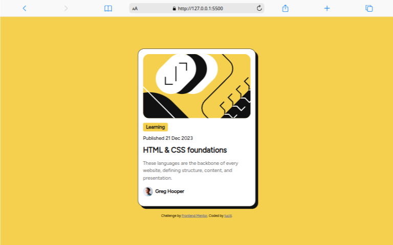
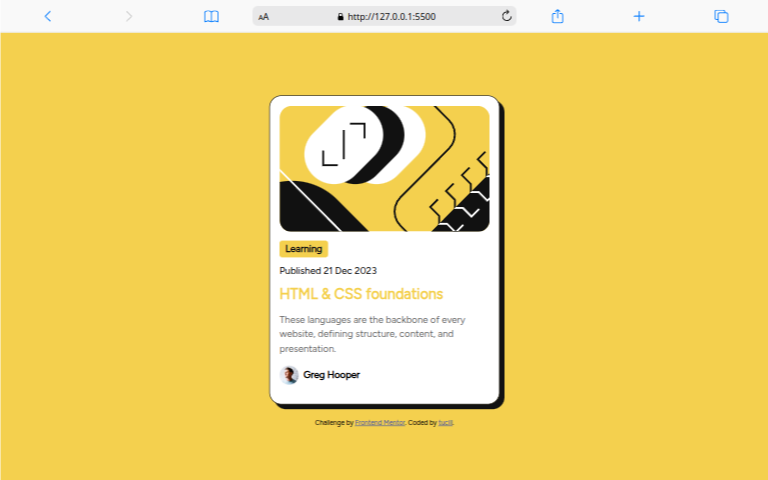

# Frontend Mentor - Blog preview card solution

This is a solution to the [Blog preview card challenge on Frontend Mentor](https://www.frontendmentor.io/challenges/blog-preview-card-ckPaj01IcS). Frontend Mentor challenges help you improve your coding skills by building realistic projects.

## Table of contents

- [Overview](#overview)
  - [The challenge](#the-challenge)
  - [Screenshot](#screenshot)
  - [Links](#links)
- [My process](#my-process)
  - [Built with](#built-with)
  - [What I learned](#what-i-learned)
  - [Continued development](#continued-development)
  - [Useful resources](#useful-resources)
- [Author](#author)
- [Acknowledgments](#acknowledgments)

## Overview

### The challenge

Users should be able to:

- See hover and focus states for all interactive elements on the page

### Screenshot




### Links

- Solution URL: [my solutions](https://your-solution-url.com)
- Live Site URL: [my site](https://tucill.github.io/blog-preview-card/)

## My process

### Built with

- Semantic HTML5 markup
- CSS custom properties
- Flexbox

### What I learned

Use this section to recap over some of your major learnings while working through this project. Writing these out and providing code samples of areas you want to highlight is a great way to reinforce your own knowledge.

To see how you can add code snippets, see below:

```html
<h1>Hello tucill</h1>
```

```css
.card {
  display: flex;
}
```

```js
const sayHi = () => {
  console.log("Hi I'am tucill");
};
```

### Continued development

I want to continue to develop and gain experience in creating beatiful and interactive websites.

### Useful resources

- [Example resource 1](https://www.w3schools.com) - It helps to learn the basic of creating web.
- [Example resource 2](https://www.freecodecamp.org/learn) - This helps hands-on practice creating a

## Author

- Website - [tucill](https://tucill.github.io/blog-preview-card/)
- Frontend Mentor - [@tucill](https://www.frontendmentor.io/profile/tucill)
- Instagram - [@tucill.xyz](https://www.instagram.com/tucill.xyz)

## Acknowledgments

Thank you, Frontfend Mentor, for this challenge! I really appreciate the opportunity to develop my skills through challenging and interesting projects. This was a very valuable learning experience for me.
